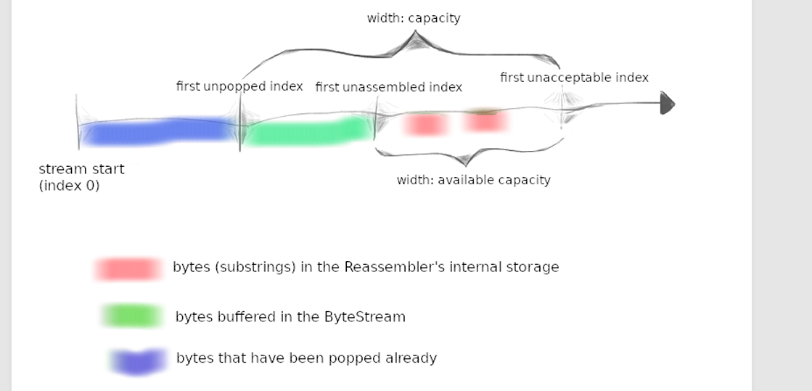
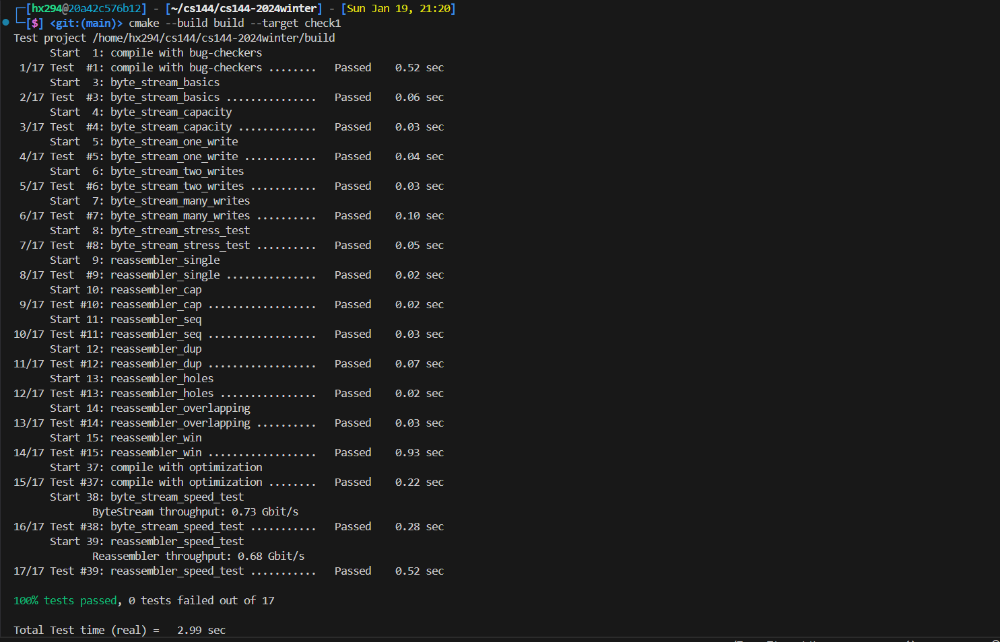
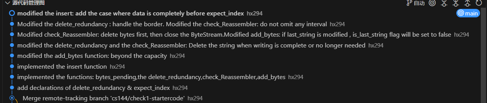

# Lab Checkpoint 1:

**stitching substrings into a byte stream**

##  0 Overview

在 checkpoint1 我们使用了 Internet stream socket 来获取网页和发送邮件，这是Linux内置的tcp实现。这个TCP设法产生了一对可靠顺序字节流，尽管深层的网络只提供best-effort 服务。这意味着： 可能丢失，乱序，修改，重发短数据包。

实现：

an “outbound” ByteStream, for data that a local application writes to a socket and that your TCP will send to the peer, and an “inbound” ByteStream for data coming from the peer that will be read by a local application.

##  1 Getting started

```sh
git fetch cs144
git merge cs144/check1-startercode
cmake -S . -B build
cmake --build build
```

##  2 Putting substrings in sequence

As part of the lab assignment, you will implement a TCP receiver: the module that receives datagrams and turns them into a reliable byte stream to be read from the socket by the application—just as your webget program read the byte stream from the webserver in Checkpoint 0.

TCP 分成小端（substring 不超过 1460），这样才能装进数据报。但可能乱序，丢弃，重发。接收方需要将端重新组合成开始的连续字节流。

 In this lab you’ll write the data structure that will be responsible for this reassembly: a Reassembler. It will receive substrings, consisting of a string of bytes, and the index of the first byte of that string within the larger stream(字符串的第一个字节在流中的索引）. **Each byte of the stream** has its own unique index, starting from zero and counting upwards. As soon as the Reassembler knows the next byte of the stream（只要Reaseembler知道Stream的下一个字节）, it will write it to the Writer side of a ByteStream— the same ByteStream you implemented in checkpoint 0. The Reassembler’s “customer” can read from the Reader side of the same ByteStream

```c++
 // Insert a new substring to be reassembled into a ByteStream.
 void insert( uint64_t first_index, std::string data, bool is_last_substring );
 // How many bytes are stored in the Reassembler itself?
 uint64_t bytes_pending() const;
 // Access output stream reader
 Reader& reader();
```

>  Why am I doing this? TCP robustness against reordering and duplication comes from its ability to stitch arbitrary excerpts of the byte stream back into the original stream.(任意拼接字节流片段) Implementing this in a discrete testable module will make handling incoming segments easier.(离散可测试模块实现将更好控制接受的片段)

 The full (public) interface of the reassembler is described by the Reassembler class in the **reassembler.hh** header. Your task is to implement this class.You may add any private members and member functions you desire to the Reassembler class, but you cannot change its public interface.

###  2.1 What should the Reassembler store internally?

insert方法 告诉 Reassembler 一个ByteStream 的新片段并告诉它在整个流中的位置(子串的起始地址)

Reassembler 控制的三个方面：

1.  Bytes that are the **next bytes** in the stream. The Reassembler should push these to the stream (output .writer()) as soon as they are known
2.  Bytes that **fit within the stream’s available capacity** but can’t yet be written, because earlier bytes remain unknown. These should be stored internally in the Reassembler
3.  Bytes that **lie beyond the stream’s available capacity.** These should be discarded. **The Reassembler’s will not store any bytes that can’t be pushed to the ByteStream either immediately, or as soon as earlier bytes become known**（不能立即推送（指超过容量这种情况）并且不能在较早字节变已知后推送.

 The goal of this behavior is to **limit the amount of memory** used by the Reassembler and ByteStream, no matter how the incoming substrings arrive.We’ve illustrated this in the picture below. The “capacity” is an upper bound(上限) on both:

1. The number of bytes buffered in the reassembled ByteStream (shown in green), and 
2. The number of bytes that can be used by “unassembled” substrings (shown in red)



这个图画得很清楚了，要对应到checkpoint0的那些函数。

**这几个变量都很有用。**


###  2.2 FAQs

-  What is the index of the first byte in the whole stream? 

流的第一位索引是0

- How efficient should my implementation be? 

The choice of data structure is again important here. Please don’t take this as a challenge to build a grossly space- or time-inefficient data structure—the Reassembler will be the foundation of your TCP implementation. You have a lot of options to choose from. 这里要求数据结构的效率要高，因为是TCP实现的基础。

 We have provided you with a benchmark; anything greater than 0.1 Gbit/s (100 megabits per second) is acceptable. A top-of-the-line Reassembler will achieve 10 Gbit/s.

- How should inconsistent substrings be handled?

默认全部一致

- What may I use? 

You may use any part of the standard library you find helpful. In particular, we expect you to use at least one data structure.

- When should bytes be written to the stream?

As soon as possible. The only situation in which a byte should not be in the stream is that when there is a byte before it that has not been “pushed” yet. 

- May substrings provided to the insert() function overlap? Yes
- Will I need to add private members to the Reassembler? 

 Substrings may arrive in any order, so your data structure will have to “remember” substrings until they’re ready to be put into the stream—that is, until all indices before them have been written(之前的所有索引都被写入过). 需要一个记录写入的索引

- Is it okay for our re-assembly data structure to store overlapping substrings? （重叠子串

No. It is possible to implement an “interface-correct” reassembler that stores overlapping substrings （可以实现. But allowing the re-assembler to do this undermines the notion of “capacity” as a memory limit（但会破坏capacity 作为内存限制这一概念. If the caller provides redundant knowledge about the same index, the Reassembler should only store one copy of this information

- Will the Reassembler ever use the Reader side of the ByteStream? 

No—that’s for the external customer. The Reassembler uses the Writer side only

- How many lines of code are you expecting?

50~60

## 3 Development and debugging advice

 Youcantest your code (after compiling it) with `cmake --build build --target check1`



没有下降很多。

多使用git来提交表示实现的功能，或者修改的原因。

英语还是太菜了。



- 提高代码可读性。

使用合理清晰的变量名。在困难的地方进行注释。**防御性编程，显示检查函数和不变量的前提条件，并当出错时抛出异常，这个我在过程中忘记做了**。使用模块化，重复的代码和很长的函数使代码难以追踪，这点深有体会，如果使用一个函数写下全部代码，不仅很多冗余，而且自己也难以看下去。

- 使用现代c++

遵循lab 0中的代码风格，偶尔需要用到move()


如果build时卡住，删除 build文件夹： `rm -rf build`,然后使用：`cmake -S  . -B build`

## 4 Submit

- Structure and Design. 

使用了 vector<pair<string,pair<uint64_t,bool>>> 的数据结构。考虑过用map，但是当时debug不出来，遂换成了vector。使用map插入时更快，不用将reassembler里存储的字节片段都遍历一遍，代码更简单，时间肯定也更短。

- Implementation Challenges. 

当时在去除冗余字节时，需要判断边界条件，这容易出错。

还有data的分类：丢弃，直接写入，先放入reassembler。

- Remaining Bugs.

我也不知。

使用了大概12 小时。三天左右。

