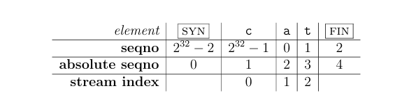
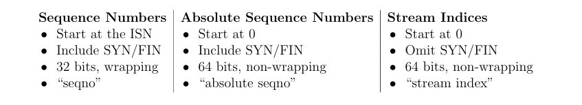
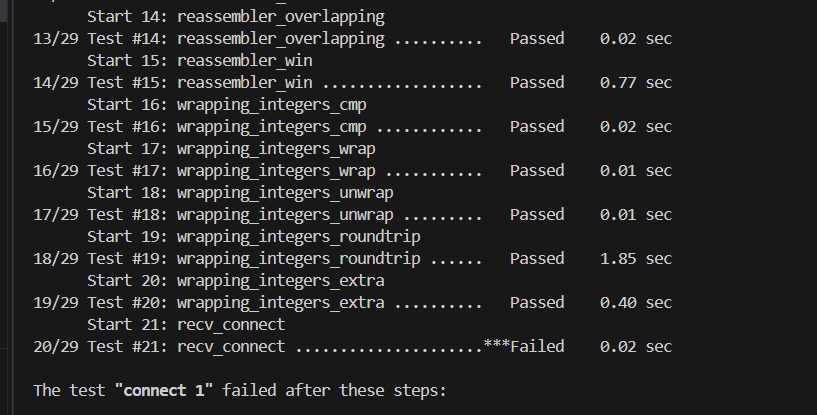
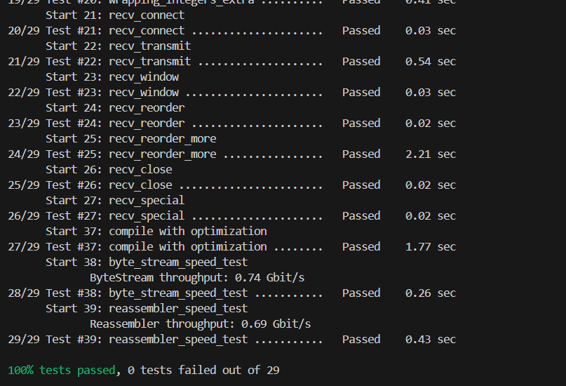

# Lab check2: the TCP Receiver

##  0 Overview

check0 实现的ByteStream 和 check1 实现的Reassembler 并不对应TCP中具体的细节。在check2 中将实现TCPReciver，实现了TCP的部分功能：处理传入的字节流。

TCPReciver从发送方接收报文(通过receive方法)并交付到Reassembler，最终写到ByteStream。程序从ByteStream中读取字节，就像在Lab 0 中从TCPSocket中读取。

同时，TCPReciver也通过send()方法生成报文发送给对等体发送方。这些接收方报文负责告诉发送方：

- 第一个未组装的索引，叫做 acknowledgment number （**ackno**）。这是接收方需要的从发送方接收的第一个字节。
- output ByteStream 的空闲容量。叫做“窗口容量”（**Windows size**)

ackno 和 window size 描述了接收方的窗口：TCP发送方允许被发送的索引范围。通过这个窗口，接收方可以控制传入的数据流，使得发送方限制发送的数量直至接收方准备获取更多。

我们有时将**ackno**叫做窗口的左边界（TCP 接收方感兴趣的最小索引），**ack+window size** 作为右边界（刚好超出TCP接收方感兴趣的最大索引）。

在编写 Reassembler 和 ByteStream 时，您已经完成了实现 TCPReceiver 所涉及的大部分算法工作;这个lab的重点是将这些通用类与 TCP 的具体细节进行连接。最困难的部分涉及思考TCP如何表示每个字节在流中的位置---seq number。

## 1 Getting started

1. Make sure you have committed all your solutions to Checkpoint 1. Please don’t modify any files outside the top level of the src directory, or webget.cc. You may have trouble merging the Checkpoint 1 starter code otherwise.
2. While inside the repository for the lab assignments, run git `fetch --all` toretrieve the most recent version of the lab assignment.

发现原来的库已经删除了，在网上找到了备份并fork了下来。[hx294/CS144-2024-winter-backup: Backup of the orginal CS144-2024-winter repo](https://github.com/hx294/CS144-2024-winter-backup)

3. Download the starter code for Checkpoint 2 by running `git merge origin/check2-startercode`.

4.  Make sure your build system is properly set up: `cmake -S . -B build`

5. Compile the source code: `cmake --build build`

6. Open and start editing the writeups/check2.md file. This is the template for your lab writeup and will be included in your submission

## 2 Checkpoint 2: The TCP Receiver

TCP是一个在不可靠数据报之上可靠传输一对流控制的字节流（一个方向一个）的协议。对等体同时是TCP 中的发送方和接收方。

这周你将实现TCP中的接收方部分，负责接收来自发送方的报文，重组字节流（包括结束时的处理）并决定应该被发回发送方的确认和流控制报文。

> Why am I doing this?  These signals are crucial to TCP’s ability to provide the service of a flow-controlled, reliable byte stream over an unreliable datagram network. In TCP, acknowledgment means, “What’s the index of the next byte that the receiver needs so it can reassemble more of the ByteStream?” This tells the sender what bytes it needs to send or resend. Flow control means, “What range of indices is the receiver interested and willing to receive?” (a function of its available capacity). This tells the sender how much it’s allowed to send

###  2.1 Translating between 64-bit indexes and 32-bit seqnos

作为一个热身，我们需要实现TCP表示索引的方式。lab1中实现的Reassembler 重组子串，子串的每个索引是64-bit 的**流索引**，第一位是0。64-bit索引足够大，我们可以看成不会溢出。然而在TCP的header中，空间非常宝贵，每个字节的索引在流中使用32比特的 sequence number表示而不是64-bit。增加三个复杂性：

1. **Your implementation needs to plan for 32-bit integers to wrap around.** Streams in TCP can be arbitrarily long—there’s no limit to the length of a ByteStream that can be sent over TCP. But 232 bytes is only 4 GiB, which is not so big. Once a 32-bit sequence number counts up to 232 − 1, the next byte in the stream will have the sequence number zero.

wrap around是回绕的意思，即溢出。

2. **TCP sequence numbers start at a random value:**为了增强鲁棒性和避免在相同两端下 属于之前连接的旧数据报混淆，TCP尝试让seqno不被猜出和不能重复。 So the sequence numbers for a stream don’t start at zero. The first sequence number in the stream is a random 32-bit number called the Initial Sequence Number (ISN). This is the sequence number that represents the “zero point” or the SYN (beginning of stream). The rest of the sequence numbers behave normally after that: the first byte of data will have the sequence number of the ISN+1 (mod 232), the second byte will have the ISN+2 (mod 232), etc.
3. **The logical beginning and ending each occupy one sequence number:**除了保证接收所有的数据比特，TCP还保证流的开始和结束可靠接收。Thus, in TCP the SYN (beginning-of stream) and FIN (end-of-stream) control flags are assigned sequence numbers. Each of these occupies one sequence number. (The sequence number occupied by the SYN flag is the ISN.) Each byte of data in the stream also occupies one sequence number. Keep in mind that SYN and FIN aren’t part of the stream itself and aren’t “bytes”—they represent the beginning and ending of the byte stream itself

这些seqnos通过每个TCP段的头来传输。（并且，有两个流，每个方向一个。每个流有不同的seqno和不同的ISN).有时讨论关于“绝对序号（absolute sequence number）”和流索引（stream index）的概念十分有用。

为了具体说明区别，考虑字节流‘cat'。如果SYN 的序号是 $ 2^{32}-2$,然后每个字节的顺序序号和，绝对序号，流索引为：



TCP中三种不同类型的索引



在绝对序号和流索引切换很简单，只用增加或删除1.不幸的是，序号和绝对序号之间转化有点难，混淆这俩会造成棘手的bug。为了系统阻止这些bug，我们将使用自定义类型表示序列号：Wrap32,并且写序列号和绝对序列号（64-bit）的转化。Wrap32 是一个封装类型：包括一个内部类型（uint32_t)的类型但是提供不同的函数或操作。

接下来就是实现各个函数。

1. `static  Wrap32 Wrap32::wrap( uint64_t n , Wrap32 zero_point )` 

转化 absolute seqno -> seqno 

2.  `unt64_t unwrap( Wrap32 zero_point, uint64 t checkpoint ) const` 

seq-> absolute seqno

给定一个Wrap32， zero_point , checkpoint,找到对应的**最接近**checkpoint的绝对序列号。因为一个序列号会对应很多绝对序列号，所以需要checkpoint。

提示1：最简单或简洁的方法将会使用wrapping_integers.hh中的帮助函数。wrap或unwrap方法需要保存偏移：两个序号相差17 对应的两个绝对序列号页相差17。

提示2：wrap 一行， unwrap少于10行。



21个测试过不了，因为还没实现其余部分，只完成转换的测试。加上两行注释一共11行代码

###  2.2 Implementing the TCP receiver

这部分实现 TCPReceiver。它将实现$ (1) $从对等体发送方接收消息和使用Reassembler重组ByteStream和$ (2) $ 发送包含确认与窗口大小的消息回对等体发送方。总共15行代码

首先，回顾TCP发送方消息格式。它包括关于ByteStream的信息。这些报文从TCPSender发给它的对等体TCPReciver。

```c++
 /*
 * The TCPSenderMessage structure contains five fields (minnow/util/tcp_sender_message.hh):
 *
 * 1) The sequence number (seqno) of the beginning of the segment. If the SYN flag is set,
 *
 this is the sequence number of the SYN flag. Otherwise, it's the sequence number of
 *
 *
 the beginning of the payload.
 * 2) The SYN flag. If set, this segment is the beginning of the byte stream, and the seqno field
 *
 contains the Initial Sequence Number (ISN)-- the zero point.
 *
 * 3) The payload: a substring (possibly empty) of the byte stream.
 *
 * 4) The FIN flag. If set, the payload represents the ending of the byte stream.
 *
 should be aborted.
 * 5) The RST (reset) flag. If set, the stream has suffered an error and the connection
 *
 */
 struct TCPSenderMessage
 {
 Wrap32 seqno { 0 };
 bool SYN {};
 std::string payload {};
 bool FIN {};
 bool RST {};
 // How many sequence numbers does this segment use?
 size_t sequence_length() const { return SYN + payload.size() + FIN; }
 };

```

TCPReceiver 生成自己的报文发送给对等体TCPSender：

```c++
 /*
 * The TCPReceiverMessage structure contains three fields (minnow/util/tcp_receiver_message.hh):
 *
 * 1) The acknowledgment number (ackno): the *next* sequence number needed by the TCP Receiver.
 *
 This is an optional field that is empty if the TCPReceiver hasn't yet received the
 *
 *
 Initial Sequence Number.
 * 2) The window size. This is the number of sequence numbers that the TCP receiver is interested
 *
 to receive, starting from the ackno if present. The maximum value is 65,535 (UINT16_MAX from
 *
 *
 the <cstdint> header).
 should be aborted.
 * 3) The RST (reset) flag. If set, the stream has suffered an error and the connection
 *
 */
 struct TCPReceiverMessage
 {
 std::optional<Wrap32> ackno {};
 uint16_t window_size {};
 bool RST {};
 };
```

TCPReceiver 的任务是接收这几种消息其中之一并发送给另一方。

```c++
class TCPReceiver
 {
 public:
 // Construct with given Reassembler
 explicit TCPReceiver( Reassembler&& reassembler ) : reassembler_( std::move( reassembler ) )
 // The TCPReceiver receives TCPSenderMessages from the peer's TCPSender.
 void receive( TCPSenderMessage message );
 // The TCPReceiver sends TCPReceiverMessages to the peer's TCPSender.
 TCPReceiverMessage send() const;
 // Access the output (only Reader is accessible non-const)
 const Reassembler& reassembler() const { return reassembler_; }
 Reader& reader() { return reassembler_.reader(); }
 const Reader& reader() const { return reassembler_.reader(); }
 const Writer& writer() const { return reassembler_.writer(); }
 private:
 Reassembler reassembler_;
 };

```

####  2.2.1 receive()

每次从对等体发送方发送的一个新的报文段被被接受，这个方法都会被调用。

这个方法需要：

- **设置 初始序列号如果有必要。**到达的第一个设置SYN 标志的报文段的序列号是ISN。为了保持在32-bit序列号或接收号和绝对序列号之间转换，你需要关心上面那个。                                                 
- **把数据写入Reassembler。**如果在TCPsegment的头部中FIN 标志被设置，意味着载荷的最后一个byte是整个流的最后一个byte。记住Reassembler的流索引从0开始，你将不得不解封序列号来生成索引。

## 3 Development and debugging advice

1. 实现tcp_receiver.cc 中的TCPReceiver的公共接口。你可以添加任何私有接口。你可以在tcp_receiver.hh中的TCPReciver类中添加任何私有成员。

2.  `cmake --build build --target check2`

3. using Git in lab 0 document
4. 使用注释来解释复杂或者微妙的代码。使用防御性攻击--显示检查函数或不变量，如果出现任何错误则抛出异常。在设计中使用模块化。
5. 使用现代c++风格在checkpoint 0 提到过。



差不多用了15行，除去注释的话。

