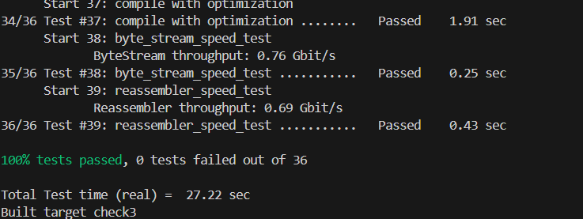

# Lab Checkpoint 3: the TCP sender

##  0 Overview

check0 实现了ByteStream。check1 和 check2实现了把不可靠报文段转化为字节流的工具：Reassembler·和TCPReceiver。

现在，你将在check3中实现连接的另一端。TCPSender是一个用于转化出站字节流为不可靠数据段。最后，在check4中，你将将结合前面的工作来创建一个可工作的TCP实现：TCPpeer，包括一个TCPSender和一个TCPReciver。你将使用这个和一个同学或者互联网上的朋友交谈--使用TCP的真正的服务器。

##  1 Getting started

还是和check3-startercode合并。

`git merge cs144/check3-startercode`

确保系统正确设置

 `cmake -S . -B build`

编译源码

`cmake --build build`

记住频繁使用git做小提交。

## 2 Checkpoint 3: The TCP Sender

TCP是一个建立在不可靠数据报上可靠传输一对流控制字节流的协议。

TCPSender负责：

- 追踪接收方的窗口大小。（通过ackno和window size）
- 通过读取ByteStream尽可能填充窗口并创建TCP报文段（如果需要SYN和FIN就填充）和发送。发送方应该保持发送报文段直到窗口已满或者传出ByteStream已经空了。
- 跟踪那些被发送但没有被接受方确认的报文段。我们称之未完成报文段。
- 重发未完成报文段，如果在他们发出一段时间后仍没有被确认。

> Why am I doing this? 最基本的原则就是发送接收方允许发送的（填充窗口），并保持重传直到接受方确认每个报文段。这叫做自动重传协议（ARQ）。发送方划分字节流为报文段并发送和接收方窗口一样多的报文段。由于你上周的工作，我们认识到远程TCP接收方可以重够字节流只要它接收到每个被索引标记的字节至少一次，无论顺序。发送方的任务就是保证接收方得到每个字节至少一次。                                                                                                                                                                                                           

### 2.1 How does the TCPSender know if a segment was lost?

你的TCPSender将发送一堆TCPSenderMessages。每个包含传出ByteStream的一个子串（可能为空），被索引成一个序号来表明在流中的位置，并且在流的开始有SYN标志，末尾有FIN 标志。

另外发送这些报文段，TCPSender也不得不跟踪它的未完成报文段直到它们的序列号被全部确认。TCPSender 的所有者会定期调用 TCPSender 的 tick 方法，表示时间的流逝。TCPSender负责查看未完成的TCPSenderMessages 并决定最旧发送的报文段是否在没有确认的情况下未完成太长时间（就是它所有的序列号都没有被确认）。如果，就会被重发。

下面是“未完成太久”的规定。你将实现这个逻辑，它有点详细，但是我们不想你担心潜在的测试样例试图绊倒你。我们将给你合理的单元测试，充分的整体检测将在你lab4完成整个TCP实现之后。只要你100%通过那些测试并且你的实现合理，都可以。

> ⋆Why am I doing this?  整体目标是让发送方及时检测那些片段何时消失并需要重发。在重发之前等待的时间数是重要的：你不想发送方去等太长时间来发送一个报文段（因为延迟了流向接收方的字节），但是你也不想发送一个即将被确认的报文段而只等待一小会儿--这浪费因特网珍贵的容量。

1. 每几个毫秒，你的TCPSender的tick方法将传入一个参数调用。这个参数用于说明距离上次方法调用一共经历了多少毫秒。用来维护TCPSender活着的总共时间这个概念。不要尝试从操作系统或CPU调用任何时间或者时钟的函数--tick方法是你唯一对消逝时间的访问。
2. 当TCPSender在构造时，给了一个参数说明重传时间（RTO）的初始值。RTO是重发一个未完成TCP报文段的毫秒数。RTO将会随着时间改变，但是初始值保持不变。起始代码把初始值保存在一个成员变量叫做initial_RTO_ms_中。
3. 你将实现重发**计时器**：一个警报可以在某个时间启动，并在RTO过后，警报响起（或过期）。我们强调用时的概念来自tick方法的调用--不是获取真实的时间。
4. 每次一个包含数据的报文段（序列空间不是0）被发送（无论是第一次还是重发），如果计时器没有启动，**就让它启动**这样它会在RTO毫秒后过期（对于当前RTO的值）。过期意味着将来的时间将用完一定的毫秒数。
5. 当所有未完成的数据被确认，**停止**重发计时器。
6. 如果tick被调用并且重发计时器过期：
   1. 重发最早没有被TCP接收方全部确认的报文段（最小的序列号）。你需要存储未完成的报文段在某些内部数据结构使得可以可以做到上面的事。
   2. **如果窗口大小不是**0：
      1. 跟踪连续重传的次数，并增加因为你刚刚重传了一些。你的TCPConnection将使用这个信息来决定连接是否无望（太多连续重传在一个队列中）并需要被中断。
      2. RTO乘2.这叫做指数级退避--它减少了在糟糕网络上的重传来避免进一步破坏工作。
   3. 重置重传计时器并开启，经过RTO毫秒过期。（要考虑到刚刚两倍了RTO的值）。
7. 当接收方发给发送方一个确认用于确认成功接收新数据（ackno 是一个大于之前的ackno的绝对序列号）：
   1. 重置RTO到初始值。
   2. 如果发送方有任何未完成的数据，重启重传计时器这样将会在RTO毫秒后过期（当前值为RTO）。
   3. 重置“连续重传的次数”为0。

你可以选择在一个独立的类中实现重传计时器的功能性，但这取决于您。如果你这样做，请添加到已存在的文件中（tcp_sender.hh 和 tcp_sender.cc)。

### 2.2 Implementing the TCP sender

我们已经讨论了TCP 发送方的基本概念。我们已经讨论何时确认一个未完成的报文段是丢失的并需要重发。

现在是时候看下TCPSender提供的具体接口。有四个重要的事件需要处理：

1. void push( const TransmitFunction& transmit );

   要求TCPSender从外出字节流来填充窗口：它从流读取并发送尽可能多的TCPSenderMessages，只要有新字节可以读取并且窗口中有剩余空间。通过调用已提供的transmit函数来发送。

   你想要确保每个发送的TCPSenderMessage 完全在接受者的窗口中。使每个单独的消息尽可能大，但不大于给定的值  TCPConfig::MAX PAYLOAD SIZE (1452 bytes)。

   你可以使用 TCPSenderMessage::sequence length()方法来统计一个报文段的序列号数量。记住SYN和FIN 标记各自也占据一个序列号，意味着它们占据窗口的空间。

   > ⋆What should I do if the window size is zero? 如果接收者宣布窗口大小为0，push方法应该假装窗口大小为1.发送方可能最终发送一个呗接受方拒绝的字节，但是也会促使接收方发送一个新的确认报文段，显示窗口打开了更多的空间。没有这个的话，发送方可能永远不会学习到它被允许再次发送。
   >
   > 这是你实现的唯一一个独特的例子针对0窗口的情况。TCPSender事实上应该不记住一个为1的错误窗口大小。这种特殊情况只是在push方法中。此外，请注意即使窗口大小是1（或20，或200）， 窗口大小可能仍是满的。一个满的窗口和一个大小为0的窗口是不一样的。

2.  void receive( const TCPReceiverMessage& msg );

   一个消息来自接收者，传达窗口新的左边（=ackno）和右边（ackno+window size）边界。发送方应该查看它的未完成报文段集合并移除那些已经被完全确认的。（the ackno 大于所有报文段中所有字节的序列号）。

3.  void tick( uint64 t ms since last tick, const TransmitFunction& transmit );

   经过的时间--一个准确的毫秒数自从上次这个方法调用。发送方可能需要重发一个未完成的报文段。它可以调用transmit（）函数来完成。（记住：不要在你的代码中使用真实世界的“clock"或者”gettimeofday“函数。唯一的时间经过的引用来自ms_since_last_tick 参数。）

4. TCPSenderMessage make tick argument.) empty message() const;

   TCPSender应该生成并发送序列号正确的零长度报文。这是有用的如果对等体想发送一个TCPReciverMessage（例如，因为它需要从对等体发送方确认什么）这需要生成一个TCPSenderMessage来触发它。

为了完成checkpoint 3，请回顾tcp_sender中的完整接口，以及实现tcp_sender.hh和tcp_sender.cc文件中TCPSender的公共接口。我们希望你添加私有方法和变量，可能一个帮助类。

##  2.3 FAQs and special cases

- 在 receive 方法通知它之前，我的 TCPSender 应该假设接收器的窗口大小是什么？

  1，所以初始值为1

- What do I do if an acknowledgment only partially acknowledges some outstanding segment? Should I try to clip off the bytes that got acknowledged?

   A TCP sender could do this, but for purposes of this class, there’s no need to get fancy. Treat each segment as fully outstanding until it’s been fully acknowledged—all of the sequence numbers it occupies are less than the ackno

-  If I send three individual segments containing “a,” “b,” and “c,” and they never get acknowledged, can I later retransmit them in one big segment that contains “abc”? Or do I have to retransmit each segment individually?

  再一次：TCP 发送方可以这么做，但是处于这个类的目的，没必要搞得这么花哨。只要单独监测每个未完成的报文段，当重传计时器过期，再次发送最早的未完成的报文段。

- Should I store empty segments in my “outstanding” data structure and retransmit them when necessary

   No—the only segments that should be tracked as outstanding, and possibly retransmit ted, are those that convey some data—i.e. that consume some length in sequence space. A segment that occupies no sequence numbers (no SYN, payload, or FIN) doesn’t need to be remembered or retransmitted

这个lab主要是实现push函数，考虑到SYN，FIN，载荷是否在同一个报文上，这很关键。

