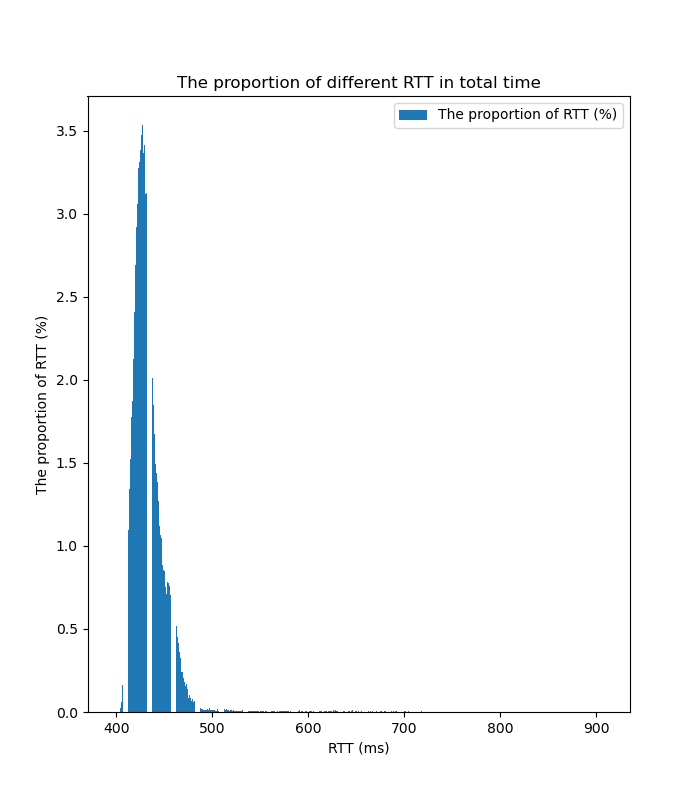

#  Checkpoint 4: interoperating in the world

## 1 Overview

到此为止，您已经以几乎完全符合标准的方式实现了 Transmission Control Protocol。

大多数TCP实现使用和你不同的策略，但是因为所有的TCP实现共享一个共同的**语言**，它们都是相互交流的，每个TCP实现可以与另外一个形成对等体。这个checkpoint在实际世界中测试你的TCP实现并 **测量**特定Internet路径的长期数据。

如果你的TCP实现正确书写， 你可能不需要写任何代码。 但是尽管经过我们的努力，还是有可能有些bug逃过了检测。如果你找到问题，你可能想要用wireshark 调试并修复bug。我们欢迎任何为TCP模块贡献的测试样例，用以捕获没有被已知测试捕捉到的bug。

##  2 Getting started

1. git fetch --all
2. git merge cs144/check4-startercode
3. cmake  -S . -B build
4. cmake --build build
5. make **small commits**

##  3 Using your TCP implementation in the real world

还记得你在 0 检查点写 webget.cc 的时候吗？您使用了 TCPSocket，这是一个对 Linux 内核的 TCP 实现进行建模的 C++ 类。您能否将其换成 TCP 实现，并且仍然有一个有效的 Web getter？

1.  `cmake --build build --target check_webget`


2. 保证你的TCP 实现没有发送调试信息给cout。这将混淆使用该TCP的程序的输出。可以给cerr但不能给cout。

3. 在合并checkpoint 4的初始代码后，给apps/webget.cc 添加 include ： ` #include "tcp_minnow_socket.hh" ` ,从TCPSocket 改为 CS144TCPSocket。 这是一个包装你的TCP实现的类，表现得像一个内核提供的socket。

4.  运行 脚本使得TCP实现有权限发送在网络上发送网络数据报：

   `./scripts/tun.sh start 144`

   每次重启都要重新运行该命令。

5. `cmake --build build --target check_webget`。如果通过，恭喜你的TCP实现成功做到与互联网上的任意电脑相互作用。
   我到这里就成功了。

6. 如果没有通过，尝试手动运行：

   ` ./build/apps/webget cs144.keithw.org /nph-hasher/xyzzy` 

   如果表现得很好：

   ```
    $ ./build/apps/webget cs144.keithw.org /nph-hasher/xyzzy
    DEBUG: minnow connecting to 104.196.238.229:80...
    DEBUG: minnow successfully connected to 104.196.238.229:80.
    HTTP/1.1 200 OK
    Content-type: text/plain
    7SmXqWkrLKzVBCEalbSPqBcvs11Pw263K7x4Wv3JckI
    DEBUG: minnow waiting for clean shutdown... DEBUG: minnow inbound stream from 104.196.238.229:80 finished cleanly.
    DEBUG: minnow outbound stream to 104.196.238.229:80 finished (0 seqnos still in flight).
    DEBUG: minnow outbound stream to 104.196.238.229:80 has been fully acknowledged.
    DEBUG: minnow TCP connection finished cleanly.
    done
   ```

   如果不是， 是时候使用wireshark 在tun144接口调试。

7. 对于调试， 你将发现 `./build/apps/tcp program_ipv4` 程序很有用。 这是一个像telnet的程序，但使用你的TCP实现。在一个终端跑 ： ` ./build/apps/tcp_native -l 0 9090` (这是服务器，使用linux'的tcp实现)。在另一个终端，跑： `./build/apps/tcp ipv4 169.254.144.1 9090`(这是客户端，使用你的TCP实现)。如果表现得好，两个对等体可以相互沟通知道 两个对等体 **都**结束它们的外出字节流。（c-d)

这部分由于wsl2的内核不完整，所以重新编译了内核，在配置文件中选择 CONNMARK模块。

```
CONFIG_NETFILTER_XT_CONNMARK=y
```

然后将之前的容器打包成镜像，并以下面的选项启动新容器：

```sh
docker run --privileged --cap-add=NET_ADMIN --cap-add=NET_RAW --device /dev/net/tun -it cs144-lab-backup:latest /bin/zsh
```

## 4 Collecting data

1. 选择一个远程主机，RTT至少是 100 ms。

   这里选择 41.186.255.86

   

2. 使用mtr 或者 traceroute 来追踪虚拟机和主机之间的路由。


3. 使用ping 跑**至少两个小时** 来收集 数据。

   `ping -D -n -i 0.2 hostname | tee data.txt `

   -D记住每行的时间戳。 -i 代表每0.2 秒发送一个icmp报文，-n代表跳过尝试使用DNS来应答一个hostname的IP地址。

   

4. 注意：每 0.2 秒设置一次默认大小的 ping 就可以了，但请不要用比这更快的流量淹没任何人。

##  5 Analyzing data

回答问题：

- 计算丢失了多少个报文响应，找出实际上发送了多少个报文，并计算总交付率。

- 最长的连续响应报文长度是多少？

- 最长的连续丢失响应报文长度是多少？

- 随着时间的推移，丢包事件是趋向于独立还是相关？即：

  - 假设 request #N 被接收，那么 request #(N+1) 也被接收的概率是多少？

  - 假定 request #N 丢失，那么 request #(N+1) 没有丢失的概率是多少？
  - 这些数字与 1 中的总交付率相比如何？能否判断出丢包是独立的还是突发性的？

- 最小的 RTT 是多少？

- 最大的 RTT 又是多少？

- 画一个 RTT 随时间变化的曲线，将 x 轴标记为真实时间，y 轴为 RTT 的毫秒数。

- 绘制 RTT 的分布直方图或累积分布函数，观察其分布形状。

- 绘制 ping #N 的 RTT 与 ping #N+1 的 RTT 之间的散点图；x 轴应当是第一个 RTT 的毫秒数，y 轴应当是第二个 RTT 的毫秒数。RTT 的相关性如何？

- 有什么总结？

  时间集中在一个区域，丢包不具有独立性。相邻时间的RTT基本一样。

时间不太够，直接借用 https://godbolt.org/z/aj3v5o7nx 这份代码。




