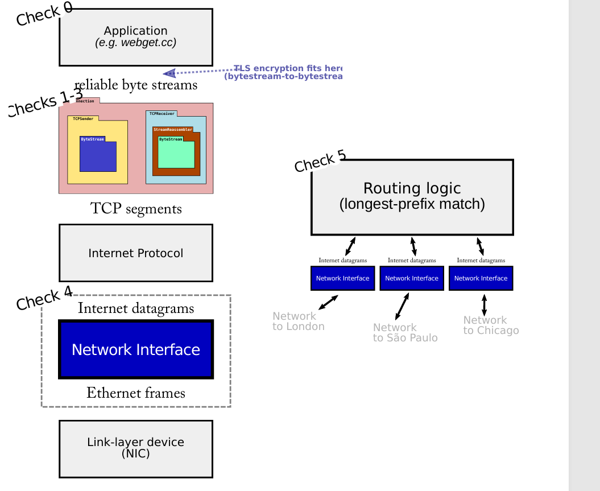

#  Lab Checkpoint 5: down the stack (the network interface)

##  0 Overview

在本周的检查点中，你将深入网络协议栈，实现一个网络接口：它是互联网数据报（在全球范围内传输）和链路层以太网帧（仅传输一个跳跃）之间的桥梁。这个组件可以安装在你之前lab的TCP/IP实现之下，但它也可以用于不同的位置： 当你在lab6构建一个路由器，它将在网络接口之间路由数据报。图一展示了网络接口如何适用于两种设置。

在过去的实验中，你写了一个TCP实现可以与其它使用TCP交流的电脑交换**TCP报文段**。这些报文段实际上如何传送到对等体的TCP实现中呢？几种选择：

- **TCP-in-UDP-in-IP ** TCP 段可以包含在用户数据报的有效负载中。当在正常的（用户空间）环境中，实施这一过程是最容易的：Linux 提供了一个接口（“数据报套接字”，UDPSocket），让应用程序只需提供用户数据报的负载和目标地址，内核负责构造 UDP 头部、IP 头部和以太网头部，然后将数据包发送到适当的下一跳。内核确保每个套接字有一个独特的本地和远程地址以及端口号组合，并且由于是内核将这些信息写入 UDP 和 IP 头部，它可以保证不同应用程序之间的隔离。

- **TCP-in-IP** 在通常使用中， TCP报文段基本直接放置在网络数据报中，IP 和TCP头部之间没有UDP头部。这就是人们收的TCP/IP的含义。这有一点难实现。Linux提供一个接口，叫做TUN设备，它允许应用程序提供完整的 Internet 数据报，其余的由内核负责（写以太网头部和实际通过实体网卡发送等等）。但现在程序自己构建了完整的IP头部，不仅仅是载荷。

- **TCP-in-IP-in-Ethernet** 在上面的方法中，我们仍然依赖于Linux内核的部分网络栈。每次你的代码写了一个IP数据报给TUN设备， Linux 不得不构建一个合适的以IP数据报为载荷的链路（以太）帧。这意味着Linux 不得不 根据下一跳的ip地址弄清下一跳的以太网目标地址。如果它不知道映射关系，Linux就广播询问“谁拥有这个ip？你的以太网地址是什么”并等待答复。

  这些函数通过网络接口来实现：一个把外来IP数据报翻译成链路帧的组件，反之依然。（在真实的系统，网络接口通常拥有eh0，eth1，wlan0等等名字。） **在这个实验中**，你将实现一个网路接口，并把它放在你的TCP/IP协议栈下。您的代码将生成原始以太网帧，这些帧将通过一个称为 TAP 设备的接口移交给 Linux，类似于 TUN 设备，但级别更低，因为它交换原始链路层帧而不是 IP 数据报。

大多数工作将寻找（和捕获）每个下一跳ip地址对应的以太网地址。这叫 **ARP协议（Address Resolution Protocol)。**

已经给了单元测试并把网络接口放到合适的地方。在实验6中，你将在TCP环境下使用相同的网络接口作为IP路由器的一部分。

图一 



左边是网络接口在IP层和链路层之间作为桥梁，就本次lab实现的功能。接口也是路由器的一部分。

##  1 Getting started

老规矩合并分支

1. `git fetch--all`
2.  ` git merge cs144/check5-startercode`

3. ` cmake -S . -B build`

4. `cmake --build build`

5. small commits

##  2 Checkpoint 5: The Address Resolution Protocol

在本实验中，您的主要任务是实现 NetworkInterface 的三种主要方法（在网络 interface.cc 文件中），维护从 IP 地址到以太网地址的映射。这种映射是一个缓存或“soft state": NetworkInterface 由于效率原因保留映射，但如果它重新启动，这个映射自然就需要重新生成并不造成问题。

> [soft state] is information (state) the user put into the system that will go away if the user doesn't maintain it. Stated another way, the information will expire unless it is refreshed.
>
> By contrast, the position of a typical simple light-switch is "hard-state". If you flip it up, it will stay up, possibly forever. It will only change back to down when you (or some other user) explicitly comes back to manipulate it.

1. ` void NetworkInterface::send_datagram(const InternetDatagram &dgram, const Adress &next_hop);`

   这个方法在当调用者想发送一个外出IP数据报给下一跳时调用。把这个数据翻译成以太网帧并发送它是接口的工作。

   - 如果目标以太网地址已知，即刻发送。创建一个以太网帧（ 类型是 EthernetHeader::TYPE_IPv4），设置载荷为序列化的数据报，并设置源和目标地址。
   - 如果未知，广播一个ARP请求寻求下一跳的以太网地址，并把IP数据报入队，等待ARP回复再发送。

   **期望**：你不想ARP请求淹没网络。如果在过去五秒内网络接口已经发送过相同IP地址的ARP请求，不要再发第二次--等待第一次回复。再一次，把数据报入队列直到你知道目标以太网地址。

2. ` void NetworkInterface::recv frame(const EthernetFrame &frame);`

   这个方法在网络中以太网帧到达时调用。这个代码应该忽略任何目标地址不是这个网络接口的帧。（意思是，以太网地址要么是广播地址，要么是接口自己的以太网地址 ethernet_address。）

   - 如果来得帧是IPV4，将载荷解析为IP数据报， 并 且如果成功(parse 返回ParseResult::NoError），就把数据报结果写入datagrams_received_队列中。
   - 如果是ARP，将载荷解析为ARPMessage并且如果成功的话，记住映射关系30秒。（ 在请求和回复中学习映射关系）另外，如果是一个ARP请求我们的IP地址，发送一个合适的ARP回复。

3. void NetworkInterface::tick(const size t ms since last tick);

   时间流逝时被调用。使任何过期的映射关系过期。

使用 ` cmake --build build --target check5`测试。

##  3 Q&A

1. 100到150行代码。

2. transmit 发送 以太网帧。、

3. 映射关系如何记录，取决于我，目前想法是使用vector动态数组。

4. 把IP地址转化为可以写入ARP消息的原始32bit整数的方法：  Address::ipv4_numeric() 

5. What should I do if the NetworkInterface sends an ARP request but never gets a reply? Should I resend it after some timeout? Signal an error to the original sender using ICMP?

   在实际中，两个都有，但这个lab中不用担心。（在实际中，一个接口如果不能得到请求的回复，将最终发送一个ICMP “主机不可达”给互联网中的初始发送方。

6. 如果一直得不到下一跳以太网的地址，是否需要丢弃？

   实际需要，但是这个lab不用管。

## 4 遇到的困难及解决办法

- 看到 NetworkInterface 嵌套了一个 OutputPort 类。这个类是抽象类，方便后续多态化，例如实现多种transmit函数以应对不同的需求。很久没见到虚函数了。

```c++
class NetworkInterface
{
public:
  // An abstraction for the physical output port where the NetworkInterface sends Ethernet frames
  class OutputPort
  {
  public:
    virtual void transmit( const NetworkInterface& sender, const EthernetFrame& frame ) = 0;
    virtual ~OutputPort() = default;
  };
```

- Parser & Serializer

  Parser 用于将报文段的载荷部分重新转化为报文格式。其实这部分不用看太多，我也是后面才发现有两个 **helper function** ,无需自己去看源代码。parse的**意图**是将其自身存储的数据，转化为对象的header和payload。             

  ```c++
  void parse( Parser& parser )
    {
      header.parse( parser );
      parser.all_remaining( payload );
    }
  ```

  Serializer 将报文转化为可作为其他报文段的载荷。这种统一性，便于解码，从而可以交流。

  ```c++
  void serialize( Serializer& serializer ) const
    {
      header.serialize( serializer );
      for ( const auto& x : payload ) {
        serializer.buffer( x );
      }
    }
  ```

  首先将头部转化为有效载荷的一部分，载荷部分由于本身就是载荷，只需要缓存进去即可。

  其中还有一个flush函数，使用了新特性。先用move将buffer_转化为右值,这样使用，然后使用emplace_back() 构造(使用的是带右移的构造函数）一个新对象。

  ```c++
  void flush()
    {
      if ( not buffer_.empty() ) {
        output_.emplace_back( std::move( buffer_ ) );
        buffer_.clear();
      }
    }
  ```

  心想这和push_back(std::move( buffer_ ))没啥区别。

  看了下源码发现本质是一个东西：

  ```c++
  void
        push_back(value_type&& __x)
        { emplace_back(std::move(__x)); }
  ```

- 少见的语法 

  constexpr : 编译时已知，必须在编译时计算出来，提高程序运行效率。

  ```c++
  static constexpr size_t LENGTH = 28;         // ARP message length in bytes
    static constexpr uint16_t TYPE_ETHERNET = 1; // ARP type for Ethernet/Wi-Fi as link-layer protocol
    static constexpr uint16_t OPCODE_REQUEST = 1;
    static constexpr uint16_t OPCODE_REPLY = 2;
  ```

  定义在struct中的static变量，通过结构体名可以直接访问，并且生命周期和类的声明周期一样。

## 5 submit

全部提交后

`cmake --build build --target format`

`cmake --build build --target tidy`

