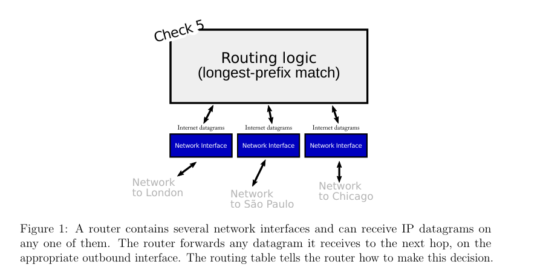
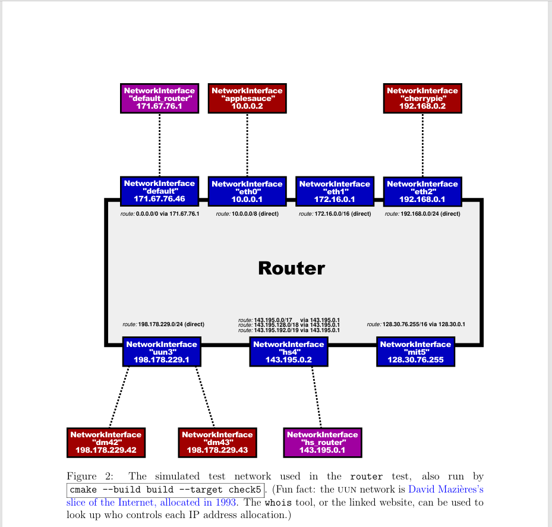
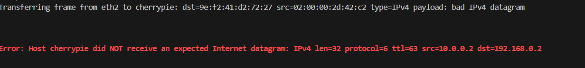

# Lab Checkpoint 6: building an IP router

##  1 Overview

本周的实验，你将在你之前的 NetworkInterface 上实现IP路由器。 一个路由器有一些网络接口，可以利用它们接收消息。路由器的工作是根据路由表来转发它获得的数据报。路由表是一个规则列表，它告诉路由器对于任何给定的数据报，如何处理。

- 从哪个接口发出。
- 下一跳ip地址

你的工作是实现一个路由器以帮助任何数据报解决上述两个问题。（你将不需要实现构造路由表的算法，例如 RIP, OSPF, BGP, 或者SDN控制器--只需要遵从路由表即可。）

你的路由器的实现将使用 Minnow库的Router类， 并且测试将在模拟网络中检查你的路由器的功能性。checkpoint 6建立在你的网络接口上，但不使用你之前实现的TCP。IP路由器没必要知道TCP，ARP，或者 Ethernet （只有IP). 我们希望你的视线需要 **30 到 60** 行代码（ `scripts/lines-of-code`)

##  2 Getting started

1. `git fetch --all`
2. ` git merge cs144/check5-startercode`
3. ` cmake -S . -B build`
4. `cmake --build build`
5. small commits

##  3 Implementing the Router



在这个实验中，你将实现一个Router类：

- 追踪路由表（ 转发规则或者路由），和
- 转发收到的每个报文段：
  - 给正确的下一跳
  - 在正确的传出NetworkInterface

你的实现 要添加到 router.hh 和 route.cc 这些 框架文件。在开始编码之前，请查看 router.hh 中新 Router 类的文档。以下是您将实现的两种方法，以及我们对每种方法的期望：

```c++
 void add_route(uint32_t route_prefix,
 uint8_t prefix_length,
 optional<Address> next_hop,
 size_t interface_num);
```

该方法将路由添加到路由表中。您需要在 Router 类中添加数据结构作为私有成员来存储此信息。这个方法需要做的就是保存路由以备后用

- 路由的各个部分是什么意思？

路由是一个 “match-action” 规则：它告诉路由器，如果数据报发往特定网络（一系列 IP 地址），并且该路由被选为最具体的匹配路由，则路由器应将数据报转发到特定接口上的特定下一跳。就是最长前缀匹配原则。

**匹配：数据报是否转发到这个网络？** route_prefix 和 prefix_length 一起描述了 一段范围的网络地址（一个 网络） ，它可能 包括了数据报的目的地址。route_prefix 是一个32为的数字IP地址。prefix_lenth是一个介于0和32的数字；它告诉路由器route_prefix的前多少位是有效的。 例如 ， 表示一个到网络 “18.47.0.0/16” （匹配前两个字节是18和47的32位IP地址）的路由， route_prefix 应该是 305070080（(18 ×224 +47×216），prefix_lenth 是16。任何数据报目的地址为 “18.47.x.y"都会匹配。

**行为：如果路由被匹配并选中应该做什么** 如果这个路由器直接连接到问题中的网络，next_hop 将是一个空操作。在这种情况下，next_hop 是数据报中的目标地址。但是如果路由器通过其他路由器与问题中的网络相连，next_hop 将是路径中的下一个路由器的IP地址。interface_num 赋予用来发送数据报给下一跳的路由器网络接口以索引。你可以通过interface(interface_num)访问接口。

```c++
 void route();
```

这里是关键所在。此方法需要将每个传入数据报路由到下一跃点，从适当的接口发出。它需要实施 IP 路由器的“最长前缀匹配”逻辑，以找到要遵循的最佳路由。意味着：

- Router 寻找 路由表，寻找匹配数据报的目标地址的路由。通过匹配，意思是目标地址的前prefix_lenth位和 route_prefix 的前prefix_lenth相同。
- 在所有匹配的路由中，路由表选择拥有最大值的prefix_lenth 的路由。这就是**最长匹配原则**。
- 如果没有匹配的，路由器丢弃这个数据报。
- 路由器减少数据报的TTL(time to live)。 如果 TTL 已经是0了，或者递减后到达0，路由器应该丢弃这个数据报。
- 此外，路由器在合适的接口上发送修改的数据报（interface（interface_num）-> sned_datagram()）给下一跳。

> 这里的 Internet 设计有一种美感（或者至少是一种成功的抽象）：路由器从来没有想过TCP、ARP，或者 Ethernet 帧。路由器不需要知道链路层是什么样的。路由器只需要考虑网络数据报，并通过 NetworkInterface和链路层进行交流。当涉及到诸如“链路层地址是如何解析的”、“链路层是否甚至有自己的不同于 IP 的寻址方案”或“链路层帧的格式是什么”或“数据报的有效载荷的含义是什么”等问题时，路由器根本不在乎。

##  4 Testing

`cmake --build build --target check5`

将会在下图展示的环境中测试。



##  5 Q&A

- 我应该使用什么数据结构来实现 路由表。

  取决于你。 但是别太疯狂。 O(n)是完全可以接受的。 如果你想更高效， 我们鼓励你在优化之前得到一个可以工作的实现。并仔细记录和注释你实现的东西。

- 把Address转化为32为整数： ` Address::ipv4 numeric() `

- 把32位整数转化为Address对象： `Address::from ipv4 numeric()`

- 怎么比较两个IP地址的前Nbit？

  这可能是任务最棘手的一部分--正确构建该逻辑。可能值得用 C++ 编写一个小型测试程序（一个简短的独立程序）或向 Minnow 添加测试，以验证您对相关 C++ 运算符的理解并仔细检查您的逻辑。

  回想在C和C++中，将32位整数移动32位会造成未定义行为。这些测试尝试在排查这些下运行代码。你可以通过执行 `./build/tests/router` 来直接来运行路由器测试。

- 如果路由器没有路由到目标地址，或者 TTL是0，需要发送ICMP 错误给数据报源吗?

  在现实中，这很有用。但是在这个Lab中没必要--丢弃数据报就足够了。（即使在现实世界中，在这些情况下，不是每个路由器会发送一个ICMP报文给源。）

## 6 遇到的困难和解决方案



出现这种情况，查看测试文档后，发现我少了重要一步：

在ttl减1后，忘记重新计算校验和。

```c++
cout << green << "\n\nSuccess! Testing applesauce sending to the Internet." << normal << "\n\n";
  {
    auto dgram_sent = network.host( "applesauce" ).send_to( Address { "1.2.3.4" } );
    dgram_sent.header.ttl--;
    dgram_sent.header.compute_checksum();
    network.host( "default_router" ).expect( dgram_sent );
    network.simulate();
  }
```

这部分比较顺利，没遇到什么困难。

## 7 Submit

 `cmake --build build --target format`

` cmake --build build --target check6`

`cmake --build build --target tidy`
