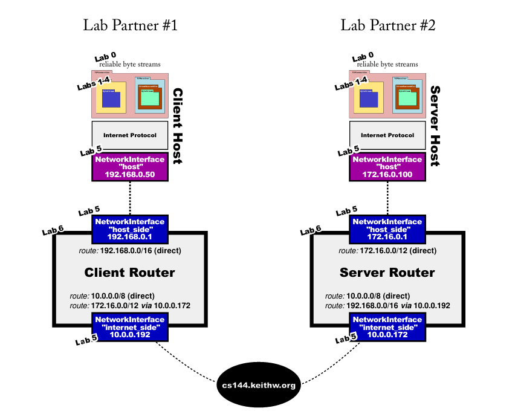
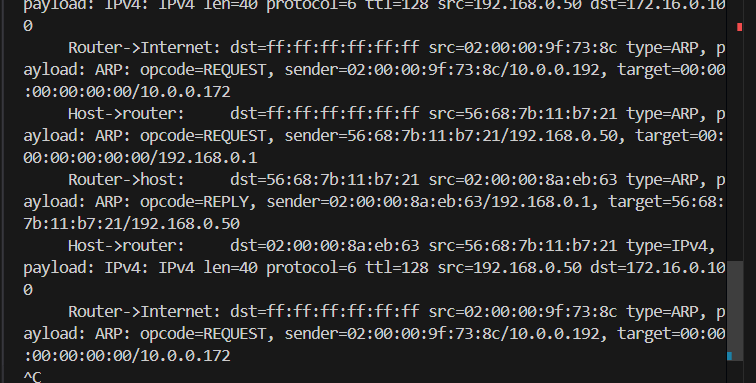
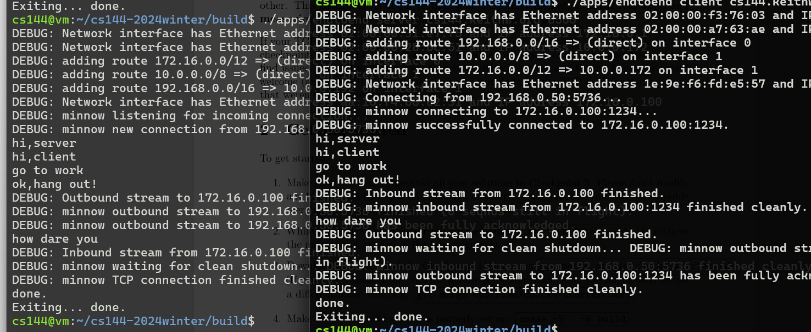
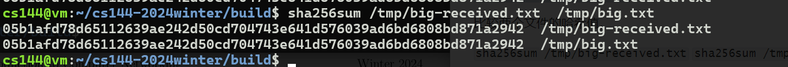

#  Checkpoint 7: putting it all together

## 1 Overview

到本课程的这一点时，您已经实现了 Internet 基础设施的很大一部分。从检查点 0（可靠的字节流）到检查点 1-3（传输控制协议）、检查点 5（IP/以太网网络接口）和检查点 6（IP 路由器），您已经完成了大量编码！

在这个 checkpoint 中，**你不一定需要做任何编码**（假设你之前的 checkpoint 工作状态良好）。相反，为了完成你的成就，你将使用你之前的所有实验来创建一个真实的网络，其中包括你的网络堆栈（主机和路由器）与班上另一名学生实现的网络堆栈通信。

此检查点是成对完成的。您需要与实验室伙伴（班上的另一名学生）合作。请使用实验室课程查找实验室合作伙伴，如果您无法参加实验室课程，请使用 EdStem。如有必要，同一学生可以多次担任“实验室合作伙伴”。

##  2 Getting started

` git fetch --all`

`git merge cs144/check7-startercode`

`cmake -S . -B build`

` cmake --build build`

**small commits**

## 3 The Network

在本实验中，您将创建一个真实的网络，将您的网络堆栈与班上其他学生实现的网络堆栈相结合。你们每个人都将贡献一台主机（包括可靠的 Byte Stream、TCP 实现和 NetworkInterface）和一个路由器：



由于您或您的实验室合作伙伴很可能位于网络地址转换器（NAT）后面，因此双方之间的网络连接将通过中继服务器 （cs144.keithw.org） 传输。

我们已将您的代码粘合到一个新的应用程序中，该应用程序可以在 build/apps/endtoend 中找到。以下是运行它的步骤：

1. 在与实验室合作伙伴一起执行这些步骤之前，请**自行尝试**。您可以通过在 VM 上使用两个不同的窗口或终端来扮演客户端和服务器这两个角色。这样，你的网络将包含两个代码副本（主机和路由器），它们与自身通信。这比与陌生人交谈更容易调试！一旦这些步骤自行完成，然后与实验室合作伙伴一起尝试。决定你们两个中的谁将充当 “客户端” ，谁将充当 “服务器”。一旦它起作用，你总是可以交换角色并重试

2. 要使用继电器，请在 1024 到 64000 之间随机选择一个偶数。这将标识您的实验室组，并且需要与同时工作的任何其他实验室组不同，因此请选择一个随机数。并且它需要是一个偶数。对于这些示例的其余部分，我们假设您选择了 “3000”。但实际上不要使用 “3000” — 它需要是一个与其他人不同的数字。

3. 在“build”目录中，“server”学生运行：`./apps/endtoend server cs144.keithw.org 3000`（将“3000”替换为您的实际数字）

    If all goes well, the “server” will print output like this:

   ```sh
    $ ./apps/endtoend server cs144.keithw.org 3000
    DEBUG: Network interface has Ethernet address 02:00:00:5e:61:17 and IP address 172.16.0.1
    DEBUG: Network interface has Ethernet address 02:00:00:cd:e7:e0 and IP address 10.0.0.172
    DEBUG: adding route 172.16.0.0/12 => (direct) on interface 0
    DEBUG: adding route 10.0.0.0/8 => (direct) on interface 1
    DEBUG: adding route 192.168.0.0/16 => 10.0.0.192 on interface 1
    DEBUG: Network interface has Ethernet address 5a:75:4e:8b:20:00 and IP address 172.16.0.100
    DEBUG: Listening for incoming connection..
   ```

4. 在“build”目录中，“client”学生运行：**`./apps/endtoend client cs144.keithw.org 3001`**（将“3001”替换为您的随机数加一）。如果一切顺利，“client” 将打印如下输出：

   ```sh
    $ ./apps/endtoend client cs144.keithw.org 3001
    DEBUG: Network interface has Ethernet address 02:00:00:41:c7:5b and IP address 192.168.0.1
    DEBUG: Network interface has Ethernet address 02:00:00:e6:66:d9 and IP address 10.0.0.192
    DEBUG: adding route 192.168.0.0/16 => (direct) on interface 0
    DEBUG: adding route 10.0.0.0/8 => (direct) on interface 1
    DEBUG: adding route 172.16.0.0/12 => 10.0.0.172 on interface 1
    DEBUG: Network interface has Ethernet address 26:05:12:4a:8a:c9 and IP address 192.168.0.50
    DEBUG: Connecting from 192.168.0.50:57005...
    DEBUG: Connecting to 172.16.0.100:1234...
    Successfully connected to 172.16.0.100:1234.
   ```

    and the “server” will print one more line: 

   ```c++
   New connection from 192.168.0.50:57005.
   ```

5. **如果您看到预期的输出**，则说明您的状态非常好 — 两台计算机已成功交换 TCP 握手！

   - 拍拍自己的后背（使用适当的社交距离协议）——你赚到了！
   - 现在是交换数据的时候了。在其中一个窗口中键入，然后看到输出显示在另一个窗口中。尝试反过来。
   - 尝试结束连接。完成后键入 ctrl-D。当每一端执行此作时，它将在该方向上结束出站 ByteStream 上的输入，同时继续接收传入数据，直到对等节点结束自己的 ByteStream。验证此情况
   - 当两端都结束了它们的 ByteStreams，并且一端已经结束了几秒钟的逗留时，两个程序都应该正常退出

6. **如果您没有看到预期的输出**，则可能是时候打开 “debug mode” 了。使用一个附加参数运行 “endtoend” 程序：将 “debug” 附加到命令行的末尾。这将打印出正在交换的每个以太网帧，您可以看到所有 ARP 和 TCP/IP 帧。

7. 在您自己的计算机上的两个窗口之间工作网络后，就可以与实验室合作伙伴（以及他们自己的实施）尝试相同的步骤了。

我在这里卡主了：Server的Router 发送了 ARP请求一直收不到 中继器的回复。



由于收不到中级服务器的回复，故一直处于host请求路由器网络接口地址，路由器发送地址给host，然后主机发送网络报文给路由器，路由器又向中继点请求地址。

干脆不折腾了，转到官网给的虚拟机中。

果然是docker这边的原因，但具体不知道。



##  4 Sending a file

一旦看起来您可以进行基本对话，请尝试通过网络发送文件。同样，您可以自己尝试一下，如果一切顺利，请与实验室合作伙伴一起尝试。方法如下：

**写一个** 1m 随机的文件到 “/tmp/big.txt"

`dd if=/dev/urandom bs=1M count=1 of=/tmp/big.txt`

要让服务器在接受传入连接后立即发送文件：

` ./apps/endtoend server cs144.keithw.org even_number < /tmp/big.txt`

要让客户端关闭其出站流并下载文件，请执行以下作：

`  </dev/null ./apps/endtoend client cs144.keithw.org odd_number > /tmp/big-received.txt`

比较两个文件的哈希值。

` sha256sum /tmp/big-received.txt` `sha256sum /tmp/big.txt`

