# Lab Checkpoint 0: networking warmup

##  1 Set up GNU/Linux on your computer

参考 https://blog.csdn.net/Kovnt/article/details/135560680#t1 用Docker搭建一个ubuntu23.10版本。

## 2 Networking by hand

### 2.1 Fetch a Web page

1. 查看 [cs144.keithw.org/hello](http://cs144.keithw.org/hello)

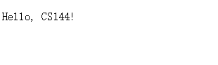

2. 使用telnet http发送请求

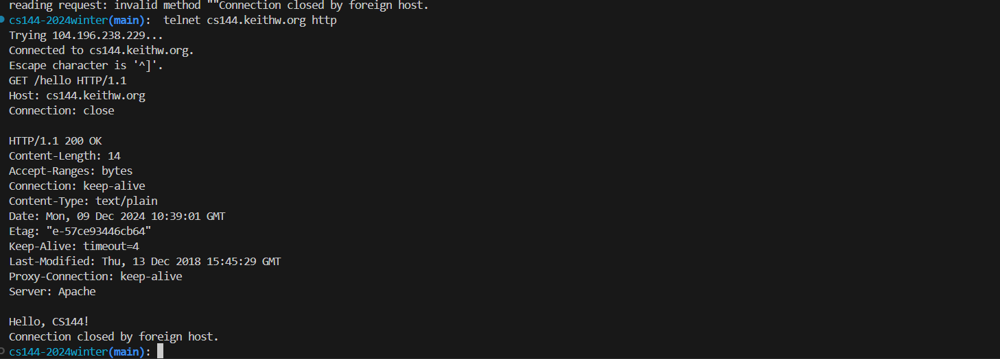

3. Assignment 访问：[cs144.keithw.org/lab0/hx294](http://cs144.keithw.org/lab0/hx294)

   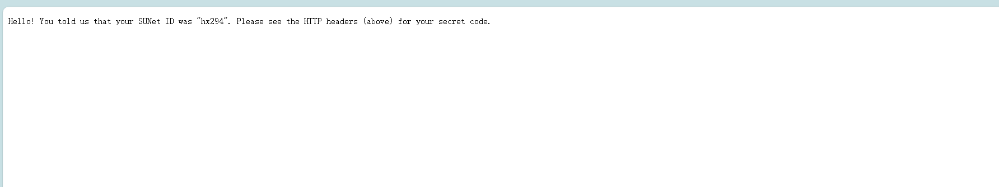

   使用 telnet访问

   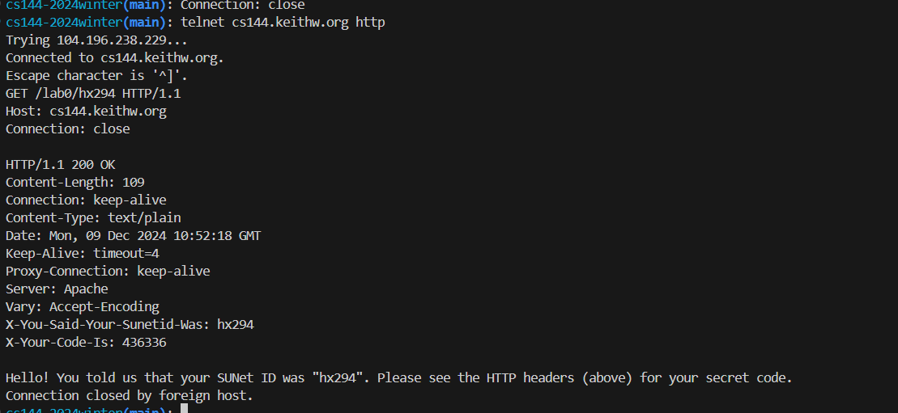

###  2.2 Send yourself an email

1. 样例
   用学校邮箱试了一下：

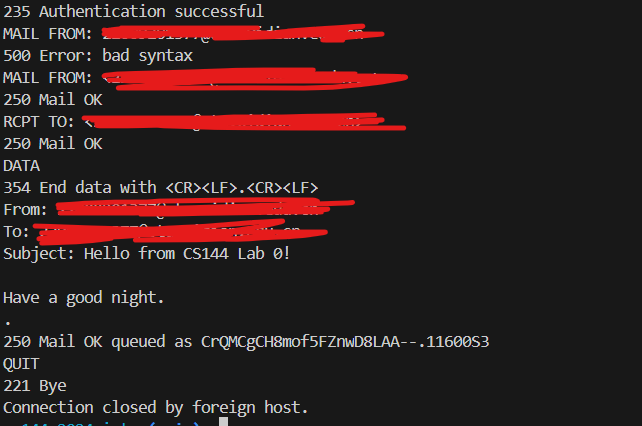

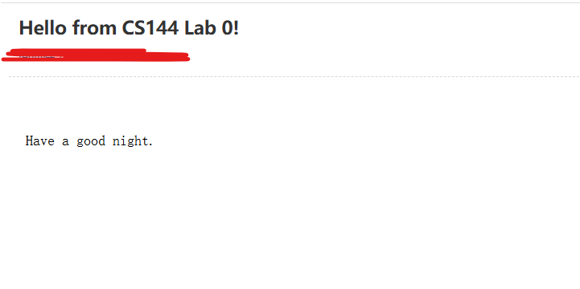

2. assignment:
   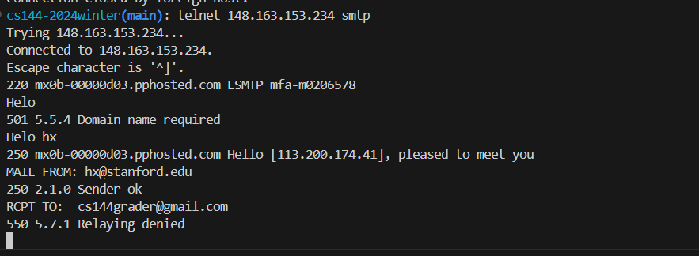

In simplest terms, the 550 error message means the receiver’s mail server blocked your message and sent it back to you.

###  2.3 Listening and connecting

服务端

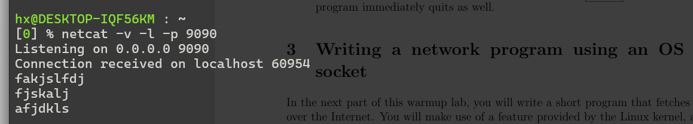

客户端

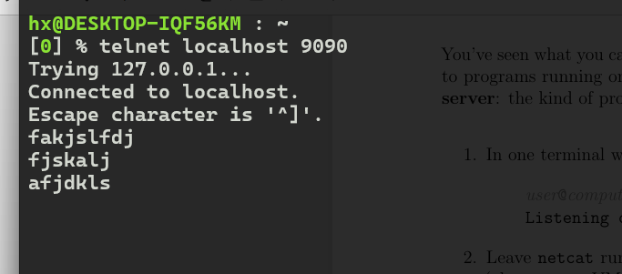

一个终端中输入并回车，另一个终端就会收到信息。

## 3  Writing a network program using an OS stream socket

这节将充分利用linux内核的一个特性：在两个程序之间创建双向字节流的能力。 一个程序在你的电脑上，另一个在其他电脑通过因特网连接。

这个特性是流套接字。对于电脑来说，套接字看起来像普通的文件描述符。

实际上，因特网不提供可靠字节流的服务。尽力而为（best effort),网络层数据报。header(sourece + destination) + payload(up to 1500).

在实际中数据报可能发生：(1) lost,丢失 (2) delivered out of order, 失序(3) delivered with the contents altered, 修改or even (4) duplicated and delivered more than once重传. 

正常来说把尽力交付转化为可靠字节流是连接两端的操作系统的任务。

### 3.1 获取和构建starter code

1. 克隆 ` git clone https://github.com/cs144/minnow` 这步可以不用，因为前面弄过了。
2. https://stackoverflow.com/questions/10065526/github-how-to-make-a-fork-of-public-repository-private 根据该链接创建私有库。
3. `cd minnow`
4. `cmake -S . -B build`
5. ` cmake --build build`

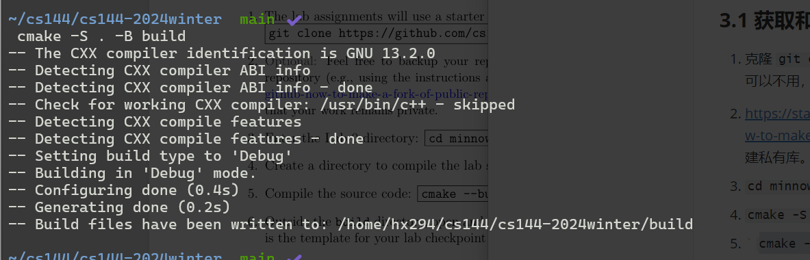

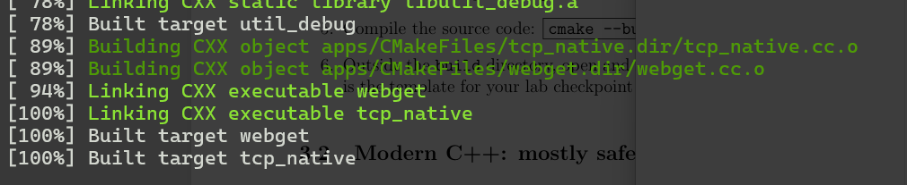

###  3.2 Modern C++: mostly safe but still fast and low-level

[C++ Core Guidelines](https://isocpp.github.io/CppCoreGuidelines/CppCoreGuidelines)

基本的思想是保证每个对象都设计成拥有最小数量的public接口，有许多的内部安全检查，很难被不正当使用和知道如何清理自身。避免使用成对操作，如malloc和free，因为可能忘记使用对操作的第二步(例如提前返回和抛出异常).而是，在构造中使用和析构中相反的操作。这种风格称做 RALL（“Resource acquisition is initialization,

要求是：

- 使用文档：https://en.cppreference.com/
- 不使用 malloc、free
- 不使用 new、delete
- 不使用裸指针，必要时使用智能指针。cs144也不需要用到这些.
- 避免 模版，线程，锁，虚拟函数。cs144用不到这些。
- 避免使用c风格的字符串或字符串函数。这些非常容易出错。只使用std::string。
- 不要使用c风格的强制转换，如( (FILE *)x)。使用C++的static_ cast必要的话。
- 倾向通过常量引用作为函数参数。（如： const Address & address
- 把不变化的变量修饰为const
- 修饰方法为const除非需要修改对象
- 避免使用全局变量，尽可能给每个变量最小的作用范围。
- 使用`cmake--build build--target tidy`来获得代码优化建议。` cmake--build build--target format` 格式化代码。

**关于使用git:** 实验通过git存储库形式分发。这是一种记录更改、检查点版本以帮助调试和跟踪源代码来源的方法。**工作时请经常使用小提交，并使用提交消息识别修改了什么以及为什么修改。**柏拉图式的理想状态是每次提交应该编译，并通过越来越多的测试。进行小的语义提交有助于调试(如果每次提交编译，并且消息描述了一件明确的事，那么调试会简单得多)。还可以通过记录伴随时间的稳定进展来保护您免受作弊索赔。这对包括软件开发的任何工作都有用处。通过https://guides.github.com/introduction/git-handbook 学习git。最后保证保存你的代码在私有仓库。

###  3.3 Reading the Minnow support code

为了支持这种风格的代码。Minnow 把操作系统函数封装起来了。

请阅读public 接口。

 util/socket.hh util/file_descriptor.hh的public部分。

注意Socket 是一种  FileDescriptor，TCPSocket 是一种 Socket。

[Socket and file descriptors - Stack Overflow](https://stackoverflow.com/questions/13378035/socket-and-file-descriptors)

###  3.4 Writing webget

在写之前建议看看socket编程。

看完头文件address 、TCPSocket

还得注意make得在build 目录使用。还需要注意如果使用vscode的话，需要把插件改成支持c++20的。

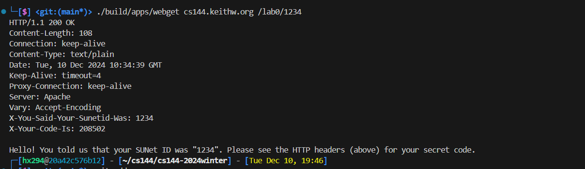

测试一下，测试在根目录。

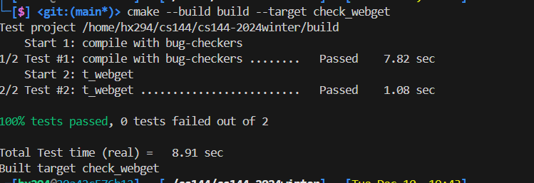

然后git提交。

##  4 An in-memory reliable byte stream

目前为止，你看到了可靠字节流的封装在因特网交流上十分有用。尽管因特网本身不提供可靠的报文段（best-effort)

为了解决这周的lab，你将在一个电脑的内存上实现一个对象提供这种封装。字节被写入input端，然后可以以相同的顺序在output方被读出。字节流是有限的： 写手可以停止输入，然后没有更多的字节被写入。当读手读到流的最后，它将读到EOF,然后不在读取。

在任何时候，为了限制 内存消耗，你的字节流 也会是 流量控制的。这个对象使用 capacity（任何时候愿意存储在内存中的最大字节数）来初始化。这个字节流将在任何时间限制写手可以写入的数量，来保证字节流不会超过存储容量。当 读者 读取字节并读尽后，写手才允许写入更多。 你的字节流在一个线程中提供使用，你不用担心同时有多个读者或写手，或者条件竞争什么的。

明确一点：字节流是有限的，但是它几乎可以随机长在写手结束输入并结束流。你的实现一定要可以控制流远大于容量。给定情况下容量限制了可以在内存中的字节数量(wirtten but not read) ，但是没有限制流的长度。 一个对象只有一个字节的容量，仍然可以实现 TB 长的流，只要这个写者保持一次写入一个字节，然后读者在写者写入下个字节前读出字节。

writer interface：

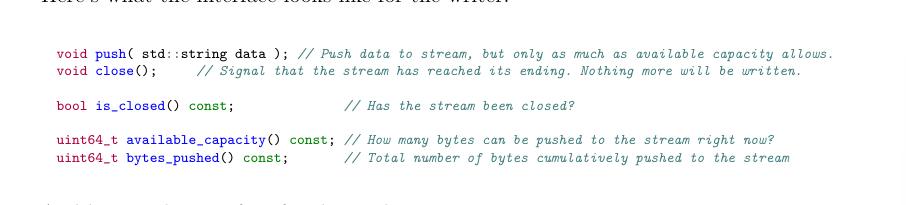

reader interface

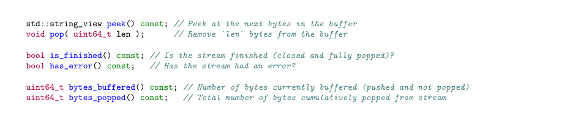

请打开 src/byte_stream.hh src/byte_stream.cc 实现一个对象提供这些接口。当你开发字节流实现，你可以测试： ` cmake --build build --target check0`

[c++ - How exactly is std::string_view faster than const std::string&? - Stack Overflow](https://stackoverflow.com/questions/40127965/how-exactly-is-stdstring-view-faster-than-const-stdstring)

最大的问题是选择什么数据结构？

这将决定push pop peek 的算法。

最终选择 循环队列的算法，以vector为基础。

重点是这里的peek的算法，由于是循环的，如果字符串在队列的头部和尾部，那么不能将所有队列中的元素转化为string_view，所以我这里只将队尾的元素peek出去。显然是不够快的，明显会减慢速度。

最终测试结果

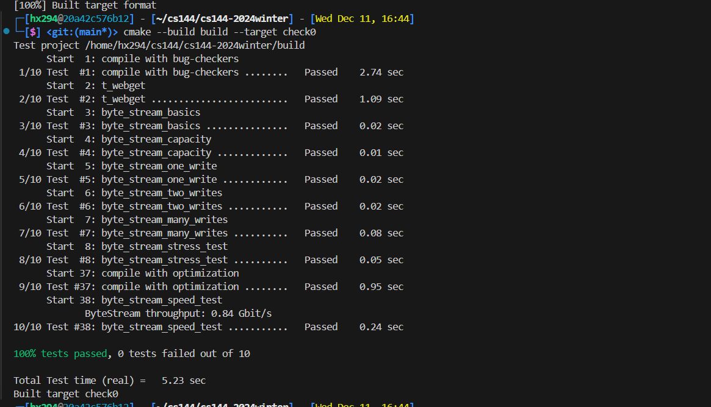

由于快到期末了，寒假再接着写。

另外看下其他人的做法：

别人有的使用了 queue<string>   并用一个视图存储即将被pop的字符串。个人拙见，这应该和题目本意有所歧义，因为实际上这个内存超过了 buffer(从实际上讲)。但是将数次的pop累积起来pop也是一个非常好的想法，能够减少pop的次数。

不过文档说只要超过 0.1Gibt/s 就可以了，就不在修改了。

